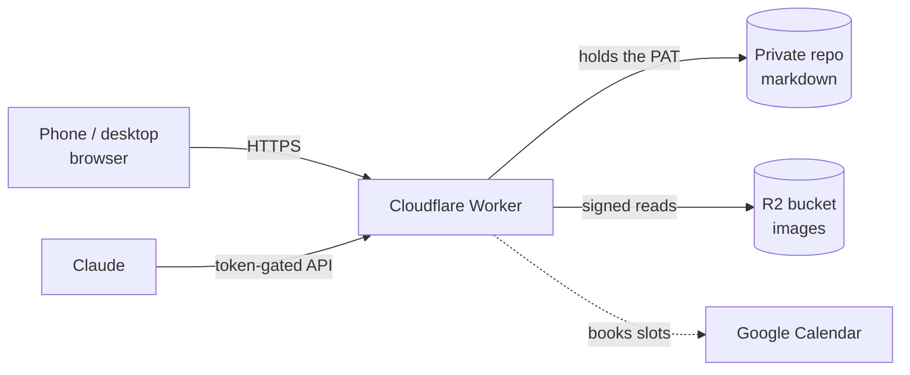

# CheckMate Spec

2026-09-19 · @Someone

## What this is

CheckMate is a text editor whose lines can carry properties. You write freely, the way you would in a plain text file, and any line can be promoted into a task that holds a domain, an importance, an estimate, a link and details — without leaving the text.

The problem it solves is **promotion, not capture**. Writing things down was never the hard part. Turning a written line into a concrete, categorized, prioritized task is, and every tool tried so far forces a choice: a text editor that can't categorize (Notepad, SimpleNote, NotesNook) or a task manager that makes you fill in fields before you can write anything (Todoist, Google Tasks).

What it is not:

- **Not a filing cabinet.** It holds what to do and when. It is not long-term storage and has no archive to search.
- **Not a deadline tracker.** Most items are self-imposed. The job is identifying what matters, not counting down.
- **Not a swipe-to-done list.** Density and scanning matter more than gestures on individual rows.
- **Not shared.** One person, one log.

## Principles

These are the tie-breakers. When a feature conflicts with one of them, the principle wins.

1. **One item, one line height.** Chips sit inline with the text so they add no vertical space. A line may wrap, and the whole wrapped line is still one item. The list is reviewed several times a day; scanning cost is the product.
2. **Text is the default, structure is opt-in.** A line stays plain prose until you give it a bracket. Nothing forces classification.
3. **No tax at the door.** Properties are added when you decide to add them, never as a precondition for writing something down.
4. **Urgency is derived, importance is stated.** Importance rarely changes, so it is typed once. Urgency changes by itself, so it is computed from a date and can never go stale.
5. **The file is the truth.** Everything on screen is recoverable from readable markdown. Nothing lives only in the app's head.
6. **Existing notation wins.** `[ ]`, `[x]` and `[-]` were already in use for years. The app adopts them rather than teaching new ones.

## The object model

A document is an ordered list of blocks. Every block has an id, a depth and text. There are three kinds:

| Kind | Looks like | Carries properties | Enter key |
| --- | --- | --- | --- |
| Heading | small caps, no marker | no | new text block below |
| Text | plain prose, no marker | no | line break inside the block |
| Task | `[ ]` marker + chips | yes | new task below |

A task holds three states, taken from the notation already in use:

| State | Means | Why it earns its place |
| --- | --- | --- |
| `[ ]` | open |  |
| `[-]` | sent, waiting on someone else | the ball is in their court — its own view |
| `[x]` | done | stays visible until deleted, on purpose |

Completed items are not hidden when you check them off. They stay in place as a record of what got done — that visible record is the point of `[x]`.

To keep the file lean they age out on their own: an item completed more than **30 days** ago is swept out of `todo.md` and is simply gone. There is no archive, no trash and no way back in the app. Git history technically still holds it, but that is a property of the storage, not a feature anyone should rely on.

### Task properties

| Property | Form | Notes |
| --- | --- | --- |
| Domain | free text | maps to a realm; see below |
| Importance | `!1` `!2` `!3` | stated once, rarely changes |
| Estimate | `~30m`, `~2h` | powers the "what fits right now" view |
| By when | a date | the only input to urgency |
| Link | URL | a page to read or act on later |
| Details | multi-line text | phone numbers, context, anything off the line |
| Schedule? | a toggle | marks it for Claude to book |
| Slot | a calendar time | written by Claude, replacing the mark |

### Ids are non-negotiable

Every block carries a short stable id (`^a3f9`). The moment Claude writes anything back into an item — a scheduled time, a calendar event reference — it has to find that exact line again after the wording has changed. Without a stable id, round-tripping silently corrupts. This is the same lesson as Garmin activity ids being the dedup key in LogTrim.

## The file format

The document serializes to markdown that stays readable and hand-editable in any editor. Properties are inline tokens after the text; details and extra lines are indented continuations.

```markdown
## Work

- [ ] Renew alcedine.com before it lapses  #Alcedine  !1  ~15m  @2026-09-22  ^n5
  - [-] Confirm the indemnification language with the lawyers  #Legal  !1  ~30m  ^n6
        Joe at the firm - 800-555-1212 or joelawyer@somelawfirm.com.
        Only reachable 9am-noon Paris time.
- [x] Send the revised MSA to Dana  #Legal  ^n8

Two things to remember:

1. buy milk
2. download app xyz.

- [ ] Read: Karpathy on evals  #Reading  !3  ~20m  [Karpathy - On evals](https://example.com)  ^n23
```

| Token | Meaning |
| --- | --- |
| `#Name` | domain |
| `!1` `!2` `!3` | importance |
| `~30m` `~2h` | estimate |
| `@YYYY-MM-DD` | by when, the input to urgency |
| `>?` | marked for scheduling, not yet booked |
| `>Thu3:15p` | the slot it landed in, written by Claude |
| `[text](url)` | link |
| `^n23` | stable id |

Indentation is two spaces per level and represents real nesting, not decoration. A multi-line text block keeps its blank lines. Continuation lines on a task are indented six spaces so they travel with the item.

The app shows this at any time behind the **Raw file** toggle. That view is not a debug aid — it is the contract, and it is how a round-trip bug gets caught before it eats a blank line.

## Domains and realms

Every domain maps to exactly one realm, Work or Personal. That mapping is a small two-column table, held once and edited in place next to the domain field:

| Domain | Realm |
| --- | --- |
| Alcedine | Work |
| ContractSafe | Work |
| Legal | Work |
| Finance | Work |
| House | Personal |
| Travel | Personal |
| Reading | Personal |

Domains are freeform. Typing a name that doesn't exist creates it, defaulted to Personal until the toggle says otherwise. Expected scale is roughly 10 to 50 open items across about 10 domains.

**Why a table and not nested headings.** The first design nested everything: `# Work` containing `## Alcedine` containing its items. At around three items per domain, the headings consume more vertical space than the content they organize, which loses the density that makes the list scannable. A domain is therefore a chip on the line, and grouping happens in a view rather than in the file structure.

Indentation still exists, but it means *this belongs under that* — a subtask, a sub-point — not *this is in that category*.

## Views

Views are pure functions over the parsed file. Nothing is stored per view, so none of them can fall out of sync.

| View | Shows | For |
| --- | --- | --- |
| Document | everything, in written order | writing and reorganizing |
| By domain | tasks grouped by domain, Work first | working inside one area |
| Matrix | open tasks in an importance × urgency 2×2 | deciding what to do next |
| Waiting on | `[-]` only | who owes you something |
| Under 15m | open, estimate ≤ 15m | a gap between meetings |
| Links | open items carrying a URL | read-later queue |

A realm filter (All / Work / Personal) and a domain filter apply on top of any view.

### The matrix

Importance and urgency are independent axes, which is what makes the 2×2 worth having rather than a sorted list:

|  | Urgent | Not urgent |
| --- | --- | --- |
| **Important (`!1`)** | Do now | Schedule |
| **Secondary** | Fit in | Someday |

Urgent means a "by when" date within three days. An item with no date is never urgent, which is the whole anti-decay mechanism: there is no urgency flag to leave stale, because there is no urgency flag.

### Links as a read-later queue

A link plus an estimate plus not-urgent makes the list an Instapaper substitute for free. "I have ten minutes, show me something to read" is the Under 15m and Links views intersecting.

## The editing model

### Keyboard

| Key | On a task | On plain text |
| --- | --- | --- |
| `Enter` | new task below | line break inside the block |
| `Shift+Enter` | line break inside the task | line break |
| `Ctrl+Enter` | end block, start a text line | end block, start a text line |
| `Backspace` on empty | delete the line | delete the line |
| `Tab` / `Shift+Tab` | indent / outdent | same |
| `Ctrl+→` / `Ctrl+←` | indent / outdent | same |
| `Ctrl+↑` / `Ctrl+↓` | move the line and everything under it | same |
| `↑` `↓` | move between lines, keeping the column | same |
| `←` `→` at an edge | wrap to the neighboring line | same |
| `Esc` | close the properties drawer | same |

Ctrl, Alt and Cmd are all accepted for the move and indent shortcuts, because `Ctrl+↑` is Mission Control on a Mac and never reaches the page.

### Promotion

Two gestures, both reversible:

1. Hover a text line and click the faint `[ ]` that appears in the margin.
2. Type ` [ ]  ` at the start of a line.

A plain text line shows no marker at rest. The bracket appears on hover so text reads as text.

### Move and indent rules

- A line may be indented **at most one level deeper than the line directly above it**.
- A heading is a hard boundary. The first line under a heading cannot be indented.
- Indent, outdent and move carry the whole subtree. A parent and its children travel together and land intact.
- Moving up or down swaps with the neighboring **sibling**, not the neighboring line.
- Structure edits work **only in the Document view**, where the order on screen is the real order. Elsewhere they are refused with a message.
- A refused operation shakes the line. Silent refusal is what made an earlier build feel random.

On a desktop, a line drags from a `∷` handle that fades in at the left edge — it sits in the margin, so it costs no width. On a phone there is no hover and no handle: **long-press a line to pick it up, then drag**.

### Properties

The `⋮` at the end of a task, or any of its chips, opens a drawer inline beneath the line — not a modal. It closes with `Esc`, the ✕, or the Close button.

### Undo

Deleting is the one destructive act in the app, so it gets an undo button holding **four levels**. It covers deleted lines and, by extension, anything a mistaken keystroke wiped out.

Undo does not reach the 30-day sweep. A completed item that ages out is gone, deliberately — undo is for accidents, not for retrieval.

## Scheduling

The **Schedule?** action takes an open item with an estimate, finds a free gap, books it, and writes the slot back onto the line.

Rules:

- Goes on the **main personal calendar**, the one actually used. Work items flow there too.
- **Never books over anything already on the calendar.** Only genuine gaps.
- Blocks are **suggestions that will get moved**, and that is fine. The calendar stays true because nothing is overwritten.
- The slot is written back as a `>` token so the item shows where it landed.

### The open constraint

**Decided: just ask.** Scheduling is a conversation, not a button. "Schedule my open items" in chat, and Claude reads the file, checks the calendar, books the gaps and writes the slots back. It works today, needs nothing built, and adds no UI.

What was rejected is the button *booking* the slot. A static page cannot summon Claude the moment it is tapped, so the button would have had to write a `@schedule` marker and wait for a scheduled task to sweep it each morning. The marker survives; the automatic morning sweep does not, and stays in reserve if asking in chat turns out to be too much friction.

The request is "please schedule my marked items," so there is a mark. The properties drawer keeps a **Schedule?** toggle, which writes a `>?` onto the line and books nothing. When asked, Claude finds every `>?`, fits them into gaps and replaces each one with the slot it landed in.

## Architecture

Private GitHub repo for the text, a Cloudflare Worker serving both the app and the API, R2 for images. All on free tiers.



### Why the Worker serves the page

GitHub Pages from a private repo requires GitHub Pro, and even then **the published site is still public** — repo privacy protects the source, not the URL. A Worker sidesteps it: free tier covers 100k requests a day, the page and the data share one origin so there is no CORS, and there is one deploy target. GitHub stops being a host and becomes storage.

### File layout

| Path | Holds |
| --- | --- |
| `todo.md` | the list. Small, loaded on every open |
| `notes/<id>.md` | long notes, loaded on demand |
| R2 `<id>/<file>.webp` | screenshots and excerpt images |

Short notes stay inline in `todo.md`. A note graduates to its own file only when it gets long or gains an image, so editing a long note never rewrites the whole list.

### Rules that fall out of the design

- **Images cannot use ``.** A private repo won't serve them. The Worker proxies image bytes, authenticated by an httpOnly cookie set at unlock, with a long `Cache-Control`.
- **Blobs go in R2, not git.** Git never forgets a binary, so every screenshot ever pasted would stay in the repo forever and slow clones permanently. R2 gives 10GB free with zero egress fees.
- **Downscale on paste, in the browser.** A 3MB phone screenshot becomes \~200KB at 1600px WebP. About fifteen lines of code, and it is most of what makes pasting images practical.
- **Pasted HTML converts to markdown** client-side rather than being stored as HTML. Keeps the file readable and avoids rendering arbitrary web HTML inside the app.
- **The blob SHA is the conflict guard.** GitHub's contents API rejects a write whose SHA has moved, which turns phone-vs-desktop collisions into a "reload, it changed" prompt rather than silent loss.
- **Git history is the undo.** Every save is a commit, so any line deleted weeks ago is recoverable.
- **`localStorage` caches the last load** so the app opens instantly on a bad connection.

### Security

The PAT lives in the Worker's environment, never in the browser. It should be fine-grained and scoped to the one repo's contents. The app's own token must be a long random string — the LogTrim-style `logtrim-abc123` is fine guarding a log that is already public, but here it is the only thing between the internet and the notes.

## What Claude does

Claude reads and writes the same markdown the app does, through the Worker. This is the capability that justifies building rather than adopting Obsidian or Notion.

| Operation | What it means |
| --- | --- |
| Schedule | fit open items into calendar gaps by estimate, write slots back |
| Triage the inbox | propose a domain and importance for unfiled lines |
| Re-ask stale flags | flag items marked important weeks ago that never moved |
| Title a link | fetch a pasted URL and fill in its real title |
| Summarize a domain | what is open, what is waiting, what is overdue |
| Break down an item | turn one vague task into indented sub-tasks |

### Safety rules

- Always base an edit on a freshly fetched file, never a cached copy or a local clone.
- Address items by `^id`, never by matching their text.
- Refuse a write that shrinks the item count unless deletions were explicitly approved — the same guard the LogTrim Worker uses.
- Propose, then write. Triage and breakdown get reviewed before they land.

## What we changed our minds about

The most useful section for future-us: each of these was designed one way, then reversed for a reason worth keeping.

| Was | Became | Why |
| --- | --- | --- |
| The problem is capture being too expensive | The problem is **promotion** | Writing things down was never hard. Turning a line into a categorized task is |
| Nested `# Work` / `## Alcedine` headings | Domain as an inline chip + a lookup table | At \~3 items per domain, headings cost more space than they organize |
| No schema, pure markdown | Inline property tokens on the line | Views and filters need real properties; prose alone can't answer "what fits in 20 minutes" |
| Urgent/Not-urgent typed by hand | Urgency computed from a date | A hand-typed flag is true when typed and a lie a week later |
| The bracket always faintly visible on text lines | Bracket appears on hover | Needed at first for discoverability; became visual noise once the gesture was known |
| `Enter` always makes a new block | `Enter` depends on the block kind | A task list wants one task per Enter; prose wants a new line |
| Depth as a per-line number | Indent and move carry the subtree | Otherwise nesting a parent silently abandons its children |
| GitHub Pages hosting | The Worker serves the page | Pages + private repo needs a paid plan, and the site is public anyway |
| Images in the repo | Images in R2 | Git never forgets a binary |

## Open questions and risks

Ranked by how likely each is to kill the project.

**1. The phone is unbuilt.** Items get captured from the phone constantly, and the prototype leans on things a phone doesn't have: hover for the promote bracket and the `⋮`, a drag handle hidden below 640px, and Ctrl-arrow for move and indent. Reordering is settled in principle — long-press and drag — but promotion, properties and indent still need phone gestures. Today a phone can type and tap a checkbox, and little else. This is the largest gap and the cheapest to fix while the prototype is still disposable.

**2. Importance still decays.** Urgency is solved by derivation. Importance is not — `!1` typed in September is an opinion from September. It stays a manual `!1`/`!2`/`!3` for now, so the mitigation is Claude periodically re-asking about old `!1`s that never moved, rather than a discipline to keep.

**3. Text blocks swallow `Enter`.** The ways out are `Ctrl+Enter`, arrow-down, or clicking away. The usual alternative — Enter on a blank line exits — was rejected because it would break a text block that deliberately contains a blank line. Worth revisiting if it feels like a trap in use.

**4. The indent cap may be too strict.** A line can only go one level deeper than the line above, so it cannot be indented until something exists above it to nest under.

**5. Eleven domain chips scroll sideways** in the filter strip on a phone. Untested at that width.

**6. The 30-day sweep is a guess.** A month may leave the list cluttered or may bin things still worth looking at. Easy to change, but worth watching for the first couple of months.

### Not yet designed

- What a marked-for-scheduling item looks like in the list — its own chip, or something quieter that doesn't compete with the domain and importance chips already on the line.

Resolved since the first draft: file growth (30-day sweep, no way back), deleted items (undo, four levels), screenshot OCR (not needed for now — the typed line beside the image carries the meaning), phone reordering (long-press and drag), scheduling (mark items with a **Schedule?** toggle, then ask Claude), and importance (stays a manual `!1`/`!2`/`!3`).
